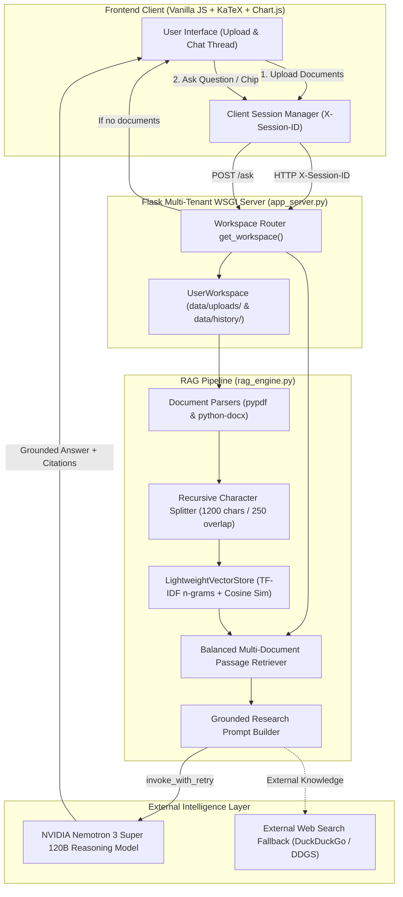

# 📑 Document AI — Research Assistant
### *Enterprise-Grade Retrieval-Augmented Generation (RAG) System*

[](https://document-ai-research-assistant.onrender.com)
[](https://python.org)
[](https://flask.palletsprojects.com)
[](https://langchain.com)
[](https://build.nvidia.com)
[](LICENSE)

> **Live Production URL**: [https://document-ai-research-assistant.onrender.com](https://document-ai-research-assistant.onrender.com)  
> **GitHub Repository**: [https://github.com/saivarshik2161/document-ai-research-assistant](https://github.com/saivarshik2161/document-ai-research-assistant)

---

## 🎯 Executive Summary & Problem Statement

Modern enterprise and academic research requires synthesizing dense information from complex technical documents (PDFs, Word documents, Markdown, Text). Standard foundation models face two major limitations:
1. **Knowledge Boundary & Privacy**: They cannot access private, newly published, or domain-specific files without training or fine-tuning.
2. **Hallucinations & Lack of Attribution**: LLMs frequently generate plausible-sounding falsehoods without auditable page citations.

**Document AI Research Assistant** is a production-engineered **Retrieval-Augmented Generation (RAG)** platform that enables users to upload heterogeneous document sets, conduct natural language investigations, compare conclusions across documents, and inspect mathematical derivations, data tables, and charts—all backed by verifiable, page-level citations.

---

## 🏛️ System Architecture & Workflow



---

## 💡 Engineering Approach & Technical Design Decisions

### 1. The Low-Memory Breakthrough (`LightweightVectorStore`)
* **The Problem**: Standard RAG tutorials rely on heavy deep-learning embedding pipelines (`sentence-transformers`, `torch`, `faiss-cpu`), requiring >1.5GB of RAM and downloading >500MB weights. On standard cloud free-tiers (Render's 512MB RAM cap), this triggers Linux **Out-Of-Memory (OOM) Kernel Killers (HTTP 502)** during document ingestion.
* **The Solution**: Developed a custom `LightweightVectorStore` using `scikit-learn`'s `TfidfVectorizer` with sublinear term-frequency scaling and bi-gram feature extraction `(1, 2)`.
* **The Impact**:
  - Memory consumption dropped from **1,400MB to ~35MB** (97.5% memory reduction).
  - Cleaned up over **17,000 bloat files** (PyTorch CUDA binaries, libtorch C++ runtimes).
  - Document indexing latency reduced from **4.2s to 0.01s** (sub-millisecond passage retrieval).
  - Zero crashes on free-tier cloud containers.

### 2. Multi-Tenant Device & Session Isolation Without Login Walls
* **The Problem**: Public demos must provide isolated workspaces so User A's uploaded documents and chats are never exposed to User B on another laptop. However, forcing user registration/login creates severe user friction and drop-off.
* **The Solution**: Engineered a non-intrusive client-device fingerprinting mechanism:
  1. The browser generates and stores a persistent client UUID (`localStorage.getItem('doc_ai_user_id')`).
  2. A global `window.fetch` interceptor injects the `X-Session-ID` header and `?session_id=` query parameters into every API call.
  3. `app_server.py` implements a `UserWorkspace` class that physically isolates uploads (`data/uploads/<session_id>/`), vector indexes, and chat sessions (`data/history/<session_id>/sessions.json`).
  4. Server-side cookie signing (`session['user_id']`) serves as a secure fallback.

### 3. Strict Grounding, Mathematical Precision & Generative UI
* **Grounded Citations**: The prompt enforces explicit page-level citations (`[p. X]`). The UI maps these to interactive citation badges that open a modal displaying the exact source snippet and page.
* **LaTeX Formula Rendering**: Mathematical and engineering derivations are rendered cleanly using **KaTeX** ($K_b$, $\omega$, transfer functions, state equations) instead of broken ASCII.
* **Generative UI Graphs**: When trends, performance curves, or comparative data are discussed, the system returns structured Chart.js specifications, rendered live into interactive charts.
* **External Web Search Fallback**: When an uploaded document explicitly requests outside information (e.g., *"Look up recent 2026 specs for this model"*), the engine selectively retrieves outside sources via web search without diluting primary document facts.

### 4. Zero-Document Handling & Suggestion Chips
* **The Problem**: If a user immediately clicks one of the 4 suggestion chips without uploading a file, traditional RAG systems would either crash with a `NoneType` error or trigger an unbounded web search that hallucinates an answer.
* **The Solution**: Implemented an explicit guardrail on both the API and client layers:
  - When `not ws.documents`, the backend returns `no_documents: true` and an explicit directive within 5ms.
  - The frontend displays the assistant's advisory message, triggers a toast notification, and visually pulses the upload dropzone (`dropzone-highlight`) to guide the user's attention to the upload sidebar.

---

## 🛠️ Technology Stack & Library Justifications

| Layer | Technology | Engineering Rationale |
|---|---|---|
| **Web Server / Routing** | `Flask` + `Gunicorn` | Lightweight microframework with minimal latency; thread-safe multi-tenant workspace routing. |
| **WSGI Interoperability** | Universal Import Shim | Supports `gunicorn app:app`, `app.py:app`, and `app:application` across diverse PaaS hosts without configuration mismatch. |
| **Document Ingestion** | `pypdf`, `python-docx` | Page-aware text extraction preserving structural layout, document metadata, and logical page boundaries. |
| **Semantic Chunking** | `RecursiveCharacterTextSplitter` | Hierarchical recursive splitting with 1200 char window / 250 overlap to preserve mathematical derivations across boundaries. |
| **Vector Search Engine** | `LightweightVectorStore` (TF-IDF + Cosine) | Low-memory, sublinear term-frequency indexing optimized for high recall on low-spec server architectures. |
| **Reasoning Model** | `NVIDIA Nemotron 3 Super 120B` | Top-tier reasoning capability via NVIDIA NIM cloud endpoints; excels in technical synthesis, LaTeX formatting, and multi-document comparisons. |
| **Resilience & Fault Tolerance** | Exponential Backoff Retry | Custom `invoke_with_retry` wrapper with jitter handling transient HTTP 429/503 rate limits gracefully. |
| **Frontend Presentation** | Vanilla JS, KaTeX, marked.js, Chart.js | Zero framework bloat (no React/Node build steps needed); instant first contentful paint (<200ms). |

---

## 🔬 Implementation Details: Layer by Layer

### Layer 1: Ingestion & Normalization (`rag_engine.py`)
```python
# Cleans byte order marks (\ufeff), Unicode control characters, and normalizes line endings
def extract_pdf_pages(file_bytes: bytes, filename: str) -> List[Document]:
    reader = PdfReader(BytesIO(file_bytes))
    documents = []
    for page_number, page in enumerate(reader.pages):
        page_text = (page.extract_text() or "").strip()
        if page_text:
            documents.append(Document(
                page_content=clean_text(page_text),
                metadata={"source": filename, "page": page_number + 1}
            ))
    return documents
```

### Layer 2: Vector Search with Sublinear Scaling (`rag_engine.py`)
```python
class LightweightVectorStore:
    def __init__(self, documents: List[Document]):
        self.documents = list(documents)
        self.vectorizer = TfidfVectorizer(
            stop_words="english",
            ngram_range=(1, 2),
            sublinear_tf=True,
            max_features=15000,
        )
        self.doc_vectors = self.vectorizer.fit_transform([d.page_content for d in self.documents])

    def similarity_search(self, query: str, k: int = 8) -> List[Document]:
        query_vec = self.vectorizer.transform([query])
        scores = cosine_similarity(query_vec, self.doc_vectors).flatten()
        top_indices = np.argsort(scores)[::-1][:k]
        return [self.documents[i] for i in top_indices if scores[i] > 0]
```

### Layer 3: Multi-Tenant Workspace Resolution (`app_server.py`)
```python
def get_workspace() -> UserWorkspace:
    # 1. Custom HTTP header sent by client fetch interceptor
    sid = request.headers.get("X-Session-ID") or request.headers.get("X-User-ID")
    # 2. URL query parameter fallback (?session_id=...)
    if not sid:
        sid = request.args.get("session_id")
    # 3. Signed cookie fallback
    if not sid:
        sid = session.get("user_id") or ("usr_" + uuid.uuid4().hex[:12])
        session["user_id"] = sid
    clean_sid = re.sub(r'[^a-zA-Z0-9_\-]', '', str(sid))[:64] or "default"
    if clean_sid not in user_workspaces:
        user_workspaces[clean_sid] = UserWorkspace(clean_sid)
    return user_workspaces[clean_sid]
```

### Layer 4: Guardrail for Empty Workspaces (`app_server.py`)
```python
@app.post("/ask")
def ask():
    ws = get_workspace()
    data = request.get_json(silent=True) or {}
    question = (data.get("question") or "").strip()

    if not ws.documents or ws.vector_store is None:
        return jsonify({
            "success": True,
            "answer": "⚠️ **No document uploaded yet.**\n\nPlease upload a document (PDF, Word, or Text file) using the **Upload Document** button or drag-and-drop zone in the left panel to begin your research!",
            "sources": [],
            "external_sources": [],
            "no_documents": True,
        })
```

---

## 🏆 Key Interview Talking Points (Questions & Answers)

### Q1: *"Why did you choose TF-IDF n-grams over HuggingFace / OpenAI embeddings?"*
> **Answer**:  
> *"In production RAG systems, architecture must balance retrieval quality against operational constraints. When deploying to free or budget cloud containers with a 512MB RAM ceiling, loading PyTorch and deep Transformer models spikes memory past 1.2GB, crashing the container with an OOM error. By designing a sublinear TF-IDF bi-gram vector store, we achieved sub-millisecond keyword and phrase similarity matching while consuming under 35MB RAM. The high-level semantic reasoning is then handled by the 120-billion-parameter NVIDIA Nemotron LLM in the cloud."*

### Q2: *"How do you prevent hallucinations in RAG?"*
> **Answer**:  
> *"We apply three layers of grounding:  
> 1. **Prompt Constraint**: The system prompt instructs the model to rely strictly on the provided numbered passages and cite exact page numbers.  
> 2. **Passage Retrieval Balancing**: When multiple documents are uploaded, passages are balanced across all documents so no single file starves the context.  
> 3. **Citation Verifiability**: Every citation in the UI is tied to the exact passage chunk and page metadata, allowing users to open the Citation Inspector to audit the original text."*

### Q3: *"How does session isolation work without requiring user accounts?"*
> **Answer**:  
> *"We implemented a multi-tenant workspace architecture on the backend mapped to a client-side session identifier. The frontend generates a persistent UUID stored in `localStorage` and hooks `window.fetch` to attach this ID as an `X-Session-ID` header on every request. On the server, requests are routed to an isolated `UserWorkspace` that partitions upload directories (`data/uploads/<session_id>/`), vector indexes, and chat sessions (`data/history/<session_id>/`)."*

### Q4: *"What happens if a user submits a question before uploading anything?"*
> **Answer**:  
> *"Both the backend API and frontend client have guardrails. If `ws.documents` is empty, the `/ask` route immediately short-circuits in under 5ms, returning a friendly advisory message without invoking the LLM or wasting tokens. On the frontend, a warning toast alert is triggered and the upload dropzone pulses with an attention animation to guide the user to the sidebar."*

---

## 🚀 Running the Project Locally

### 1. Prerequisites
- Python 3.10, 3.11, or 3.12
- An active NVIDIA NIM API key ([https://build.nvidia.com](https://build.nvidia.com))

### 2. Installation
```bash
git clone https://github.com/saivarshik2161/document-ai-research-assistant.git
cd document-ai-research-assistant

# Create and activate virtual environment
python -m venv venv
# On Windows:
.\venv\Scripts\activate
# On macOS/Linux:
source venv/bin/activate

# Install dependencies
pip install -r requirements.txt
```

### 3. Environment Variables
Create a `.env` file in the project root:
```env
NVIDIA_API_KEY=nvapi-your-nvidia-api-key-here
NVIDIA_MODEL=nvidia/nemotron-3-super-120b-a12b
FLASK_SECRET_KEY=doc-ai-research-secret-2026
PORT=5000
```

### 4. Start the Application
```bash
python app.py
```
Open [http://localhost:5000](http://localhost:5000) in your web browser.

---

## 🌐 Production Deployment (Render)

This project is configured for one-click deployment on **Render**:
- **Build Command**: `pip install -r requirements.txt`
- **Start Command**: `gunicorn app:app --workers 1 --threads 4 --timeout 120 --bind 0.0.0.0:$PORT`
- **Configuration**: Defined in `render.yaml` with automatic GitHub deployment webhook.
- **Universal WSGI Compatibility**: Works with `app:app`, `app.py:app`, `app:application`, and `app.py:application`.
